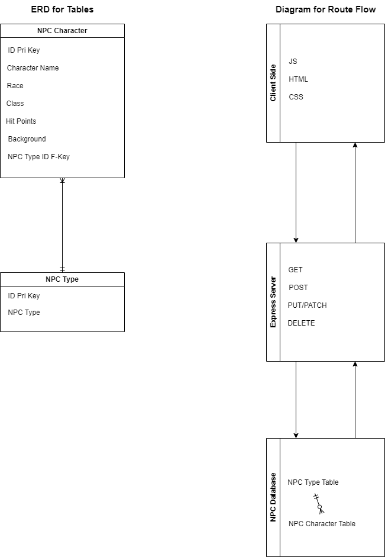

# full-stack-sp
This is my first attempt at making a full stack application. It is pretty basic, as I'm just learning how to put all the front-end and back-end pieces together.

First, a little bit about me. I am a lover of almost all things Dungeons and Dragons. I've been a player, a DM, and a guide for new players many times throughout the years. I first started playing on 2nd edition in high school and have continued with every edition through 5th. I have enormous passion for the game and would love to one day weave that passion with my growing programming skills to deliver an outstanding product to the DnD community.

The purpose of the stack is to create an API that will store basic information for Dungeon Masters (DMs) to use for creating and storing NPC characters for their campaigns in Dungeons and Dragons. This API does not fall under the OGL from Wizards of the Coast and the content is not from the System Reference Document. This is a free program that I am testing for personal use only and I receive no compensation for any material or service provided here.

I started by drawing out an ERD for my database and tables, and diagramming the information flow from client to server to database:

For now, the tables are somewhat basic and limited, but, as my experience grows, I want to grow the capability of my database as well.

Once I established how I wanted to map my tables, I set up my postgreSQL server through Docker and did some tests to make sure they were communicating.

The express.js file contains the server portion of the stack and works with the package.json to make sure all of my node modules are there. The server is a RESTful server and should handle any basic CRUD requests for the Characters. At this time, the NPC Type table is not editable by the user, but that functionality may be added in the future.

The app.js, index.html, and index.css are the client-side files that handle the webpage. As of now, the functionality ends when the page loads, but in the future I plan to add functionality and styling to make the webpage more user-friendly and interactive.
